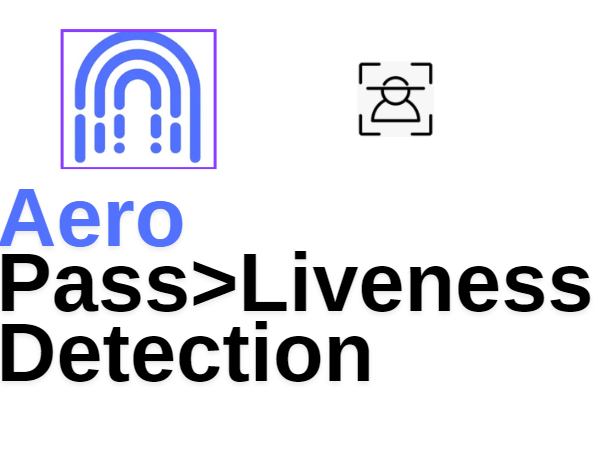

# Aeropass-Liveness-Detection-Server
Inspect multiple frames and find liveness by calculating facial vectors 

# Tech
 - Multiple facial vectors (4096 1d) captured via OpenCV sent to backend and distance between facial landmarks used to find liveness

   

# EP 
 - '/check-liveness'  -- True if human detected , false if photo or static image.

> Works with Aeropass App , it sends frames to this EP and algo captures distances between landmarks.

# Ref 

